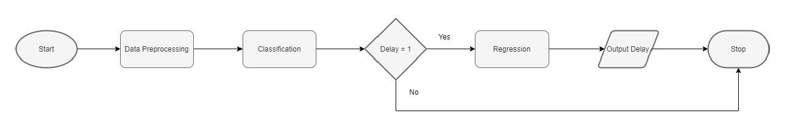

# Flight Delay Prediction

## Abstract

A flight delay occurs when an airplane takes off later than its scheduled time of departure and/or arrives later than its scheduled time of arrival. Various factors such as errors in management and trouble with the weather conditions attribute to delays. The project aims to predict
arrival delay of a flight after its departure using a two-stage machine learning model. If the flight is predicted to have an arrival delay, the delay in minutes is predicted.

### Modules

 1. Data Preprocessing modules.ipynb
 2. Classification models.ipynb
 3. Regression Models.ipynb
 4. Regression Analysis.ipynb

### Classification Models

- Gradient Boosting Classifier
- Logistic Regressor
- Extra Trees Classifier
- Decision Tree Classifier

### Regression Models

- Gradient Boosting Regressor
- Linear Regression
- Extra Trees Regressor
- Decision Tree Regressor

### Pipeline

